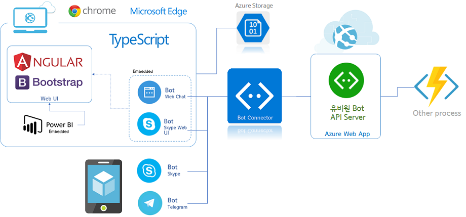
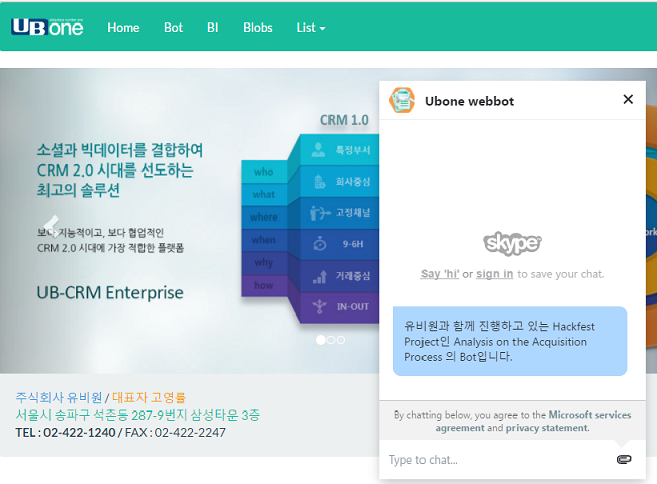
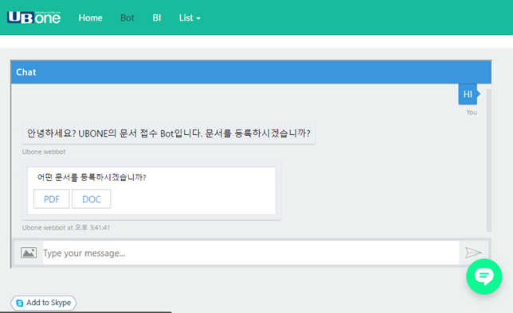
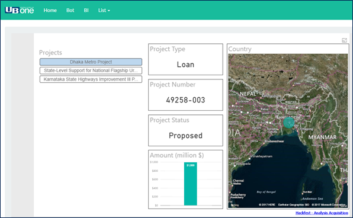
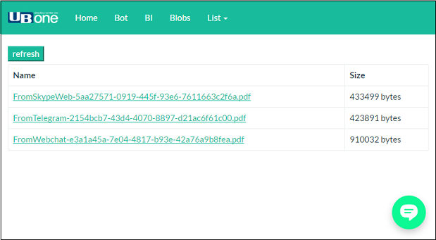
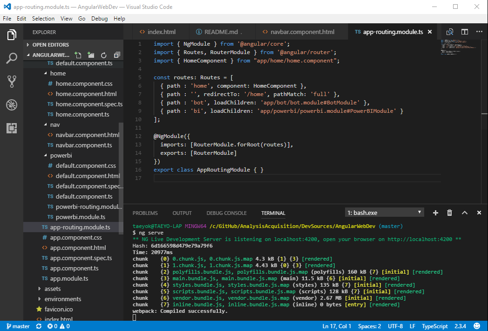

# Angular Front-end UI 

## Overview

This project was generated with [Angular CLI](https://github.com/angular/angular-cli) version 1.1.2 and angular 4.

- Sources for Web front-end UI that communicate with [Microsoft Bot App](https://dev.botframework.com/)
- deveploed with modern web-techs like Angular 4, [TypeScript](https://www.typescriptlang.org/), Angular CLI, Bootstrap, etc.
- included Power BI Embedded UI for analysis report
- also included Web Chat Bot and Skype Web Chat Bot for communicating with Bot app

The Bot app is hosting on Azure Web App.

Front-end UI Architecture is as follows.

## Snapshots 

These are snapshots of front-end web ui.

> Main page with Skype Web chat
>    
> 
> Chat bot page   
> 
>
> Power BI emebedded UI   
> 
>
> page for blob list uploaded     
> 

## Test

### Install Angular CLI if you need

Both the CLI and generated project have dependencies that require Node 6.9.0 or higher, together with NPM 3 or higher. this is a [prerequisites](https://github.com/angular/angular-cli#prerequisites)

How to install Angular cli

> npm install -g @angular/cli

### Configure Angular Web for localhost
- Run `ng serve` for a dev server. 
- Navigate to `http://localhost:4200/`. 
- The app will automatically reload if you change any of the source files.
- but, I'm not sure that Bot server is always available 

