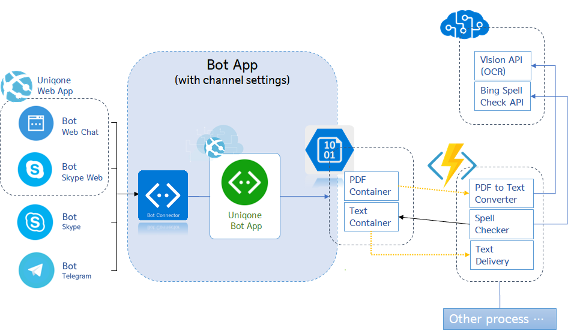
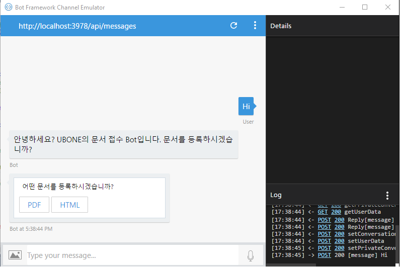

# Bot app Dev 

## Overview

This project was generated with Microsoft Bot Framework, C# and ASP.NET.

- Sources for Bot app(UBone Bot)
- developed with [Microsoft Bot framework](https://dev.botframework.com/) using C#, ASP.NET
- used multi-dialogs for conversation flow
- User can send/upload a document file(PDF only now) to Bot for asking analysis
- Bot simply rename it for preventing file-name duplicattion and forward it to Azure Blob storage for following analysis process

The Bot app is hosting on Azure Web App.

Architecture of Bot app communicating with Front-end is as follows.

## Test

### Download the Bot Framework Emulator

Download packages for Mac, Windows, and Linux are available via the [GitHub releases page](https://github.com/Microsoft/BotFramework-Emulator/releases). The latest Windows installer is available via the [emulator download page](https://emulator.botframework.com/) (download starts immediately).

### Connect and Test to a bot that is running on localhost

Launch the Bot Framework Emulator and enter your bot's endpoint into the emulator's address bar.

the default endpoint for local debugging is [http://localhost:3978/api/messages](http://localhost:3978/api/messages). This is where the bot will be listening for messages when hosted locally. Next, if your bot is running with Microsoft Account (MSA) credentials, enter those values into the Microsoft App ID and Microsoft App Password fields. For localhost debugging, you will not typically need to populate these fields, although doing so is supported if your bot requires it.

Finally, click Connect to connect the emulator to your bot. After the emulator has connected to your bot, you can send and receive messages using the embedded chat control.

