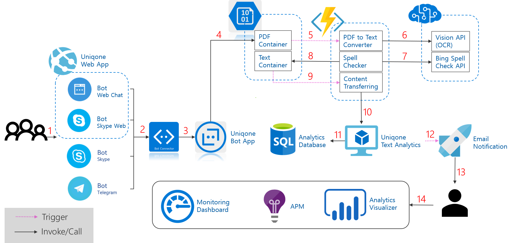

# Hackfest: Analysis Acquisition Solution with Ubiqone 

This Project is that *gathering acquisition information* in globe and *analizing risk* of it to support optimize decision. 

This Repository has sample implemtation and the purpose of it is that to explain how to utilize azure platform features to simplify development and composing each of these features.

You can download Powerpoint [silde]() and navigate slideshare [link]().

# System Architecture

The overall architecture is focusing on minimize operation and management costs and embracing a few of edge-cutting architectural features like microservices, serverless, reactive and others. And This System is using Microsoft bot technologies-*bot framework* and *connector*- to support multiple channels for the customers to upload acquisition information into system and *azure functions* and *logic app* are used to serverless hosting. Additionally, *PowerBI* is used to see the analyzed result set.
Last but least, *Azure Monitor* and *Azure Application Insight* are used to monitoring and what is going on the system and to find out the system failure and drill down the details under error situation.

*The Most of architectural features are carefully selected to show and maximize azure platform pros. and cost effectiveness.*

## Architectual Consideration
- Microservices
- Serverless
- Reactive
- Elastic
- Loosely coupled
- Asynchornous IO / Messaging 

### FrontEnd: Ingestion Acquistion Information using multiple channels.
- You can see web site source code in this [link](/DevSources/AngularWebDev), and bot app source code in this [link](/DevSources/BotDev).
- Basically, it was configured to using *skype* and *telegram* channel and web site includes two of these. but *email* or *direct line* could be configured if needed.
- *Uniqone Bot app* finally store uploaded file from bot channel into azure blob storage - *PDF Container*. *Azure Queue Storage* or *Service Bus* could be used to decrease cold start-up time of azure functions.

#### Web site 

- Basically, This web site was developed to present UI surface for the customers would be able to upload pdf file. However, this web site also shows a few of modern client side application development technologies - Angular 4, Angular CLI, TypeScript, Bootstrap and others.  
- Additionally, It could be a good sample if developers want to embed *Skype Web Chat* and *Web Chat*. 
- It also includes *PowerBI Embedded* to show analyzed result report in customers web site rather than *PowerBI* site or *PowerBI Desktop*.

*you can find out more details in [here](https://github.com/options/AnalysisAcquisition/tree/master/DevSources/AngularWebDev).*
#### File upload demo

#### Bot app

- Ubiqone bot app was developed to guide the customers to upload pdf file, correctly and manipulate the file name as appropriate form to store *azure storage*. Because a few of characters in file name are not allowed in *azure storage* and append GUID value to avoid from duplication.r
- Basically, The scenario doesn't required a complex communication flow. However, it utilized bot framework dialog based communication because of revealing the way to use it.

*you can find out more details in [here](https://github.com/options/AnalysisAcquisition/tree/master/DevSources/BotDev).*

### Backend: Optical character recognition & Spell Checking to mitigate recognition error.
- You can find out function app source code in [link](/DevSources/FunctionAppsDev).
- Whenever PDF File is stored in a specific blob storage - *PDF Container*, azure function, [ConvertPdfToTextDocument](/DevSources/FunctionAppsDev/wwwroot/ConvertPdfToTextDocument) would be triggered because the blob storage was specified as triggering event.
- This function is responsible for converting a image pdf file into multiple image files(.png) per page, and recognize characters from images using *Vision APIs* in *Cognitive Services*.
- To mitigate OCR recognition error, *Bing Spell Check* service could be used if needed.
- When the function stored recognized document into a specific blob storage - *Text Container*, *SendTextToTextAnalytics* function would send document to *Uniqone Text Analytics Service*.

*This function is using **iTextSharp** nuget package to covert image pdf to multiple image files. you can see the more details of the package in this [link](https://www.nuget.org/packages/iTextSharp/). and a sample source code is [here](https://psycodedeveloper.wordpress.com/2013/01/10/how-to-extract-images-from-pdf-files-using-c-and-itextsharp/).*

*Also, this function is using **Vision APIs** nuget package to use OCR in cognitive service. you can find out the more details [here](https://www.nuget.org/packages/Microsoft.ProjectOxford.Vision).*

*Azure function supports very easy way to utilize nuget packages using project.json files in azure function root folder. you can find out the how to use it in [project.json](/DevSources/FunctionAppsDev/wwwroot/ConvertPdfToTextDocument/project.json).*

### Analytics: Acquisition information and risks.
- *Ubiqone* and his partner already have an unique analysis solution of acquisition information and the system have been hosting in different azure subscription as a single VM type. Basically, it is more reasonable to locate this service in the same region and the same resource group and configure at least two of VMs. But, hackfest team decided to reuse on-going the system rather than to create new one.
- Additionally, Because the service endpoint could be changed and original data could be marshaled according to which sub-system has to be integration, To isolate this expected change from others, [*SendTextToTextAnalytics*](/DevSources/FunctionAppsDev/wwwroot/SendTextToTextAnalytics) was designed and this function is responsible for sending data into Text Analytics Subsystem.

### Notification
- *Logic App* is generally used to design workflow with a lot of connectors. This sample application are using *Logic App* for email notification. and it exposes http triggering point to execute the logic app - [*EmailNotifier*](/DevSources/LogicAppDev). 
- The reason of why *Logic App* was chosen to implement this function is adding new notification channel likes SMS or integration with others is relatively easy.

### Visualization: Visualization Analyzed Results.

- Power BI is the most powerful tool to visualize the result. 
- ..
- ..

### Monitoring: Application Performance Monitoring.
- ..
- ..

# Utilized Technologies
Angular, ASP.NET Core, Bot Framework, App Service(Web App), Azure Functions, Azure Logic App, SQL Database, Power-BI, etc.

